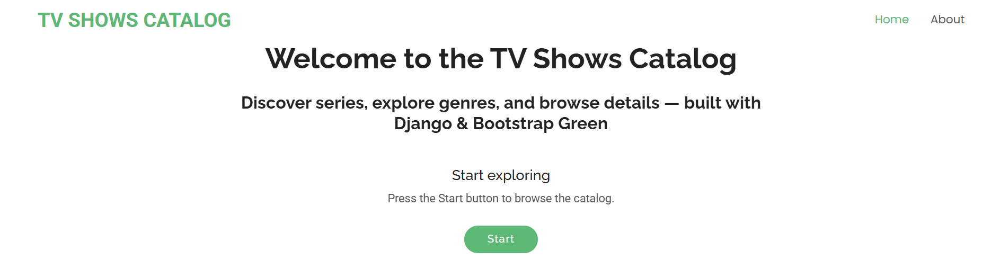
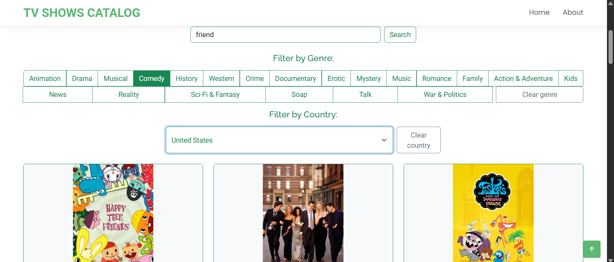
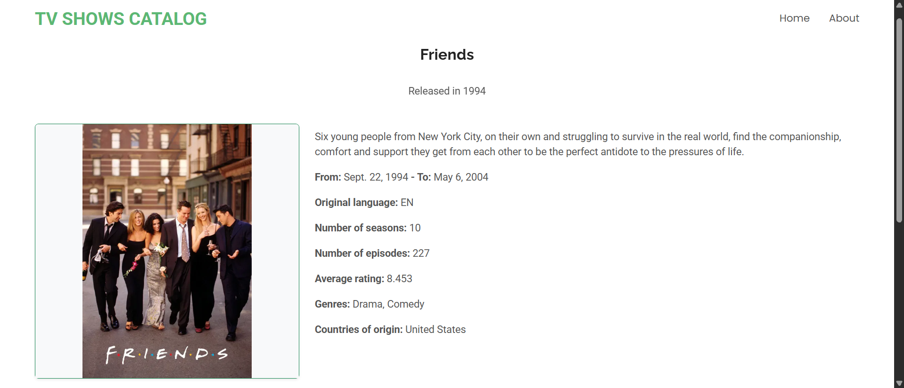

# TV Shows Catalog

## Description

TV Shows Catalog is a Django web application that allows users to browse, search, and filter a large collection of television series.

The project uses a dataset of more than 44,000 TV shows, providing information such as titles, release dates, genres, countries of origin, ratings, seasons, episodes, overviews, and poster images.

Users can search the catalog by title and refine results using genre and country filters. The application features a responsive interface built with the Bootstrap Green template and is deployed on Render using PostgreSQL as its database backend.

This project was developed as part of a back-end portfolio with a focus on relational database design, filtering and search functionality, pagination, deployment, and maintainable Django development practices.

## Live Demo

[TV Shows Catalog on Render](https://django-tvshows-catalog.onrender.com/)

## Features

- Browse a catalog of more than 44,000 TV shows.
- Search TV shows by title.
- Filter results by genre.
- Filter results by country of origin.
- Combine search and filters simultaneously.
- Pagination for improved performance and navigation.
- Detailed page for each TV show with additional information.
- TV show posters displayed in catalog and detail views.
- Responsive user interface based on the Bootstrap Green template.
- AJAX-powered filtering for a smoother user experience.
- PostgreSQL database deployment on Render.

## Technologies Used

- Python 3.12.3
- Django 5.1
- PostgreSQL
- Bootstrap 5 (Green Template)
- JavaScript
- AJAX
- WhiteNoise
- Gunicorn
- Render

## Database Design

The database was structured using a normalized relational model.

The original dataset was reorganized into separate TVShow, Genre, and Country entities, with TVShowGenre and TVShowCountry relationship tables connecting TV shows to their genres and countries. This approach avoids redundant data storage and supports reliable filtering by genre and country.

Main entities:

- TVShow
- Genre
- Country
- TVShowGenre
- TVShowCountry

## Dataset

The project uses the following public dataset:

- [All TV Series Details Dataset](https://www.kaggle.com/datasets/bourdier/all-tv-series-details-dataset)

The original dataset was cleaned and normalized before being imported into PostgreSQL. This process helped structure the data consistently for the application's relational model and filtering functionality.

After processing, the application database contains:

- 44,311 TV shows
- 21 genres
- 122 countries
- 73,357 TV show–genre relationships
- 45,693 TV show–country relationships

## Key Implementation Decisions

Several implementation choices were made during development:

- PostgreSQL was selected instead of SQLite to gain experience with a production-oriented relational database system.
- Django pagination was implemented to improve performance when browsing large datasets.
- URL query parameters preserve search and filter state, allowing filtered views to be shared and revisited.
- AJAX was selectively introduced to improve the filtering experience while keeping the overall application server-rendered and easy to maintain.
- A fallback image is displayed when poster artwork is unavailable.
- Bootstrap Green was retained as the visual foundation of the project while adapting it to the application's requirements.
- Query correctness and maintainability were prioritized before applying advanced optimization techniques.

## Dataset Notes

The dataset used for this project comes from an external source. Some entries may contain mature or explicit imagery.

Since no reliable metadata field was available to consistently identify and filter such content without removing legitimate titles, the dataset was kept largely intact.

## Screenshots

### Home Page



### Catalog — Search and Filters



### TV Show Details



## Lessons Learned

This project provided hands-on experience with:

- Django application structure and template-based development
- Relational database design and data normalization
- PostgreSQL integration and deployment workflows
- Search, filtering, AJAX interactions, and pagination
- Working with large datasets in a web application
- Deploying and maintaining a Django application on Render

## Future Improvements

Possible future enhancements include:

- Additional filtering options
- REST API version of the project
- Dockerized deployment
- User authentication and personalized features
- Further query optimization and performance tuning

## Credits

- Dataset: All TV Series Details Dataset (Kaggle)
- Front-end template: Green Bootstrap Template by BootstrapMade
- Poster images and TV show metadata originate from the dataset source

## Installation / Local Setup

1. Clone the repository:

```bash
git clone https://github.com/analauraarce/django-tvshows-catalog.git
cd django-tvshows-catalog
```

2. Create and activate a virtual environment:

```bash
python -m venv env_series_site
env_series_site\Scripts\activate
```

3. Install dependencies:

```bash
pip install -r requirements.txt
```

4. Create a PostgreSQL database named `series_project` and configure the database connection in `series_project/settings.py` with the appropriate PostgreSQL username, password, host, and port.

5. Apply migrations:

```bash
python manage.py migrate
```

6. Start the development server:

```bash
python manage.py runserver
```

The application database was built from a cleaned and normalized version of the original dataset.

The processed import files used during development are not included in the repository due to their size and project scope.

## Usage

Users can:

- Browse a catalog of more than 44,000 TV shows
- Search TV shows by title
- Filter results by genre
- Filter results by country of origin
- Combine search and filtering options
- View detailed information for each TV show
- Navigate results using pagination

## Deployment

The application is deployed on Render and uses:

- PostgreSQL as the production database
- Gunicorn as the WSGI server
- WhiteNoise for static file serving

## Author

Ana Laura Arce

GitHub: https://github.com/analauraarce
